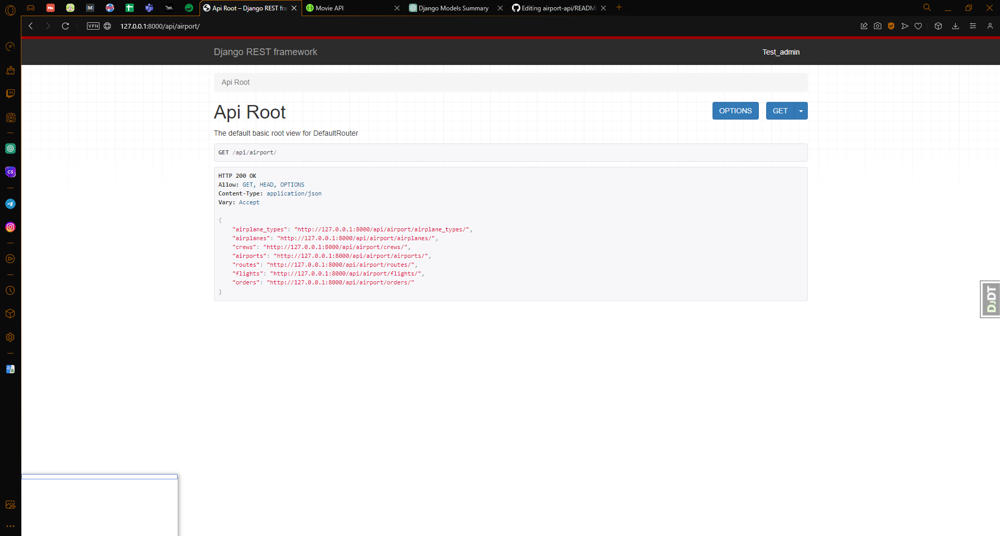
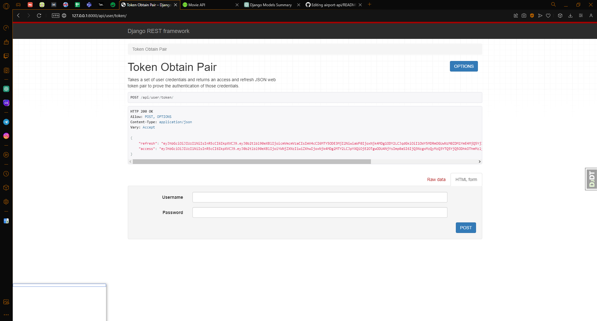
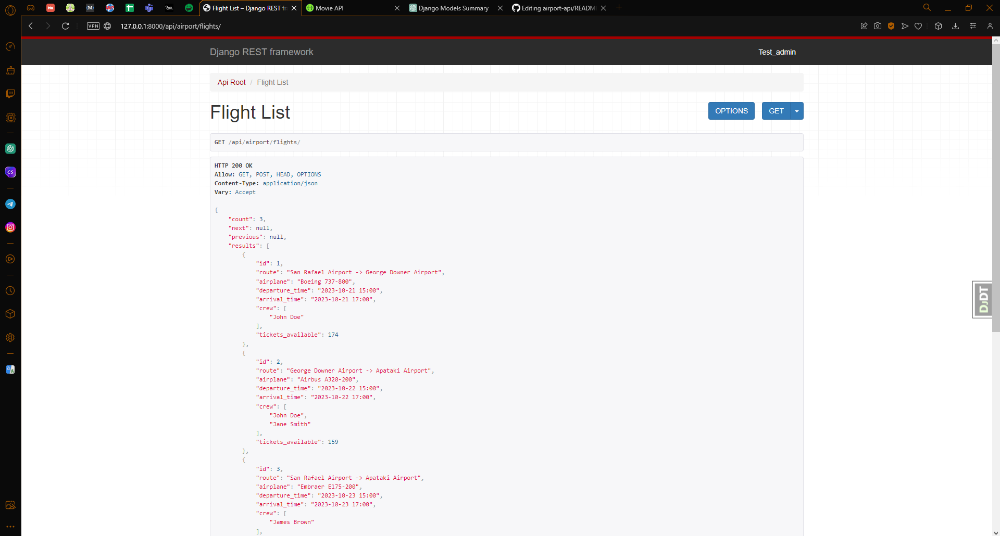

# Airport-API

This project was created to demonstrate the developer's skills in the occupation of Django & Django REST Framework

## How to run a project locally

1) Open the project folder in your IDE

2) Open a terminal in the project folder

3) If you are using PyCharm - it may propose you to automatically create venv for your project and install requirements in it, but if not:

`python -m venv venv`

`venv\Scripts\activate (on Windows)`

`source venv/bin/activate (on macOS)`

`pip install -r requirements.txt`

4) Create .env file and enter the values of the variables:

Example: 

- key: `SECRET_KEY`; value: `OcnfnCRopncxamOEFSIUNCCxce=-sceCE+F`,
- key: `DEBUG_MODE`; value: `True`

5) Use the following command to run migrations and load prepared data from fixture:

`python manage.py migrate`

`python manage.py loaddata db_data.json`

6) Use command to run server:

`python manage.py runserver`

## Get access

 - create user: `/api/user/register/`
 - get access token `/api/user/token/` (ex. AkafbLICvcIPCPbcILB)

Load ModHeader extension for your browser and add request header:

example:

- key: `Authorization`
- value: `Bearer AkafbLICvcIPCPbcILB`

## Project's Features

- JWTAuthentication
- Comfortable admin panel located at `/admin/`
- Documentation located at `api/doc/swagger/`
- Managing orders and tickets
- Creating Airplanes, Airports, Crews, etc.
- Update profile data
- Filtering crews, airports, routes

## Demo:

